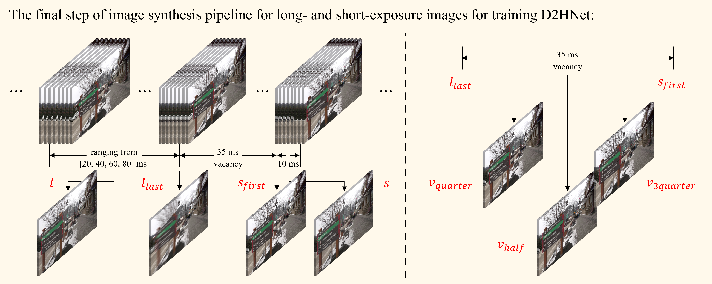

# D2HNet

<br>Official PyTorch Implementation of the ECCV 2022 Paper<br>

[Project](https://github.com/zhaoyuzhi/D2HNet) | [arXiv](https://arxiv.org/abs/2207.03294)

## 1 Introduction

This project is a night image restoration framework called D2HNet by jointly denoising and deblurring successively captured long- and short-exposure images. To train and benchmark D2HNet, we create a large-scale D2-Dataset. This repo contains training and evaluation code for the following paper:

> [**D2HNet: Joint Denoising and Deblurring with Hierarchical Network for Robust Night Image Restoration**](https://github.com/zhaoyuzhi/D2HNet)<br>
> Yuzhi Zhao<sup>1</sup>, Yongzhe Xu<sup>2</sup>, Qiong Yan<sup>2</sup>, Dingdong Yang<sup>2</sup>, Xuehui Wang<sup>3</sup>, Lai-Man Po<sup>1</sup><br>
> <sup>1</sup>City University of Hong Kong, <sup>2</sup>SenseTime Research and Tetras.AI, <sup>3</sup>Shanghai Jiao Tong University<br>
> *European Conference on Computer Vision (**ECCV**) 2022*<br>


## 2 Dependency

This code is based on PyTorch 1.1 and CUDA 9.0. It has been tested on Ubuntu 18.04 LTS, where the machine is equipped with NVIDIA Titan GPUs.

We use Anaconda to set up the environment. Users can set up a new environment simply by:

```bash
conda env create -f environment.yml
conda activate d2hnet
```

Then, users need to install the deformable convolution module in the `d2hnet` environment by:

```bash
cd dcn
python setup.py develop
```

If you got an error when installing deformable convolution module, please delete the `build` folder first and then run:

```bash
cd dcn
rm -rf build
python setup.py build develop
```

## 3 D2-Dataset

### 3.1 Download links

Users can find the full D2-Dataset through the link below. Just unzip all `zip` files after downloading. Note that the full dataset is quite large (about 555Gb).

link：https://pan.baidu.com/s/1FunrgUvjdOyhz0hgBuW3JQ?pwd=3n6m 
code：3n6m

| Name | Description | Resolution | Numbers | Size |
| ---- | ---- | :----: | :----: | :----: |
| original/train | synthetic `training` tuples | 2560x1440 | 5661 | 192GB |
| original/train_blur_patch | selected patch tuples by VarmapSelection from `train` | 1024x1024 | 9453 | 99.0GB |
| original/val | synthetic `validation` tuples from videos 1-13 | 2560x1440 | 268 | 9.44GB |
| original/val_no_overlap | synthetic `validation` tuples from videos 14-30 | 2560x1440 | 1192 | 38.7GB |
| original/val_no_overlap_blur_patch | selected patch tuples by VarmapSelection from `val_no_overlap` | 1024x1024 | 99 | 1.11GB |
| sharpened/train | MATLAB sharpened `train` tuples | 2560x1440 | 5661 | 124GB |
| sharpened/train_blur_patch | MATLAB sharpened `train_blur_patch` tuples | 1024x1024 | 9453 | 59.0GB |
| sharpened/val | MATLAB sharpened `val` tuples | 2560x1440 | 268 | 6.08GB |
| sharpened/val_no_overlap | MATLAB sharpened `val_no_overlap` tuples | 2560x1440 | 1192 | 23.2GB |
| sharpened/val_no_overlap_blur_patch  | MATLAB sharpened `val_no_overlap_blur_patch` tuples | 1024x1024 | 99 | 659MB |
| Xiaomi_Mi_Note_10_photos | `real` captured long- and short-exposure photos | 4624x3472 | 28 | 2.45GB |

Please unzip it in this path. Then, rename the full path to `data`.

### 3.2 Explanation



The explanation of the data is shown in the above image. The full resolution above image can be found in the [arXiv](https://arxiv.org/abs/2207.03294) file. The naming method of D2-Dataset data can be summarized as:

| Symbol in the above image | Name (keyword) of image files | Description |
| :----: | :----: | :----: |
| *l* | long8 | the long-exposure image of approximately 80ms exposure time |
| *l* | long6 | the long-exposure image of approximately 60ms exposure time |
| *l* | long4 | the long-exposure image of approximately 40ms exposure time |
| *l* | long2 | the long-exposure image of approximately 20ms exposure time |
| *l<sub>last<sub>* | long_last | the last frame of the long-exposure images |
| *v<sub>quarter<sub>* | quarter | the frame at the quartile position at vacancy (approximately 35ms), more approching to *l<sub>last<sub>* |
| *v<sub>half<sub>* | half | the frame at the center position at vacancy (approximately 35ms) |
| *v<sub>3quarter<sub>* | 3quarter | the frame at the quartile position at vacancy (approximately 35ms), more approching to *s<sub>first<sub>* |
| *s<sub>first<sub>* | short | the first frame of the short-exposure image |
| *s* | short | the short-exposure image; in this work we directly use *s<sub>first<sub>* as *s* due to the very short exposure time |

### 3.3 Corresponding videos

The list of all full-length original videos can be found in [original_video_list.txt](./assets/original_video_list.txt), and [youtube-dl](https://ytdl-org.github.io/youtube-dl/index.html) can be used to batch download them. Note that only part of those videos are used to create the D2-Dataset.

## 4 Train

### 4.1 Run

D2HNet has two subnets (DeblurNet and EnhanceNet) which are trained sequentially. But they share the same entering file:

```bash
python train.py
```

Users need to change the parameters of `train.py` to train a specific network, as follows:

| Name | Description | Training DeblurNet | Training EnhanceNet |
| ---- | ---- | :----: | :----: |
| --opt | network to be trained | 'options/tp_deblurnet_v2_002.yaml' | 'options/tp_denoisenet_v2_002.yaml' |
| --num_gpus | numbers of GPUs to be used | 2 | 2 |
| --save_path | saving path to trained models | 'snapshot/tp_deblurnet_v2_002' | 'snapshot/tp_denoisenet_v2_002' |
| --log_path | saving path to tensorboard results | 'log_pt/tp_deblurnet_v2_002' | 'log_pt/tp_denoisenet_v2_002' |

The `EnhanceNet` in the paper corresponds to the `DenoiseNet` in the code.

### 4.2 Hyper-parameters of the network

Users may change some parameters in the `yaml` files to fit their machine and requirement:

#### 4.2.1 Training parameters:

- epochs: overall training epochs
- train_batch_size: training batch size, where one batch denotes that selecting one training image
- num_workers: the number of workers for training dataloader
- start_idx: if the users continue the training process, please enter the previous number of trained epochs. Also, remember to change `finetune_path`
- finetune_path: the path to load pre-trained weights

#### 4.2.2 Loss and Optimizer parameters:

- VGGLoss / vgg_model_path: if users want to add the perceptual loss, please download VGG-16 officially pre-trained model: https://download.pytorch.org/models/vgg16-397923af.pth. Then, put it under `pretrained_models` folder. Otherwise, please comment out the `VGGLoss` in the `yaml` files
- lr_g: learning rate of the network
- lr_decrease_epoch / lr_decrease_factor: after every `lr_decrease_epoch`, the learning rate multiplies with `lr_decrease_factor`

#### 4.2.3 Dataset parameters:

- train_path: path to original synthetic training set (`original/train`)
- val_path: path to original synthetic validation set (`original/val_no_overlap`)
- train_sharp_path: path to sharpened training set (`sharpened/train`)
- val_sharp_path: path to sharpened validation set (`sharpened/val_no_overlap`)
- deblur_crop_size: size of the cropped square from a full-resolution image for DeblurNet
- deblur_patch_per_image: the numbers of cropped patches from a full-resolution image for DeblurNet
- deblur_size: the processing resolution of DeblurNet at training
- denoise_crop_size: the processing resolution of EnhanceNet at training, cropped from DeblurNet results
- denoise_patch_per_image: the numbers of cropped patches for EnhanceNet
- cutnoise: CutNoise-related hyper-parameters
- illum_adjust: Illumination Adjustment (IA)-related hyper-parameters
- color_adjust: Color Adjustment (CA)-related hyper-parameters

### 4.3 D2HNet pre-trained models

Users can download pre-trained models via the link below:

link：https://pan.baidu.com/s/1bLyM1aKbFBVvYwmEJyBv2w?pwd=t7wq 
code：t7wq

Please unzip it in this path, you will get a folder named `snapshot`.

## 5 Validation and Testing

### 5.1 Validation

Noisy long- and short-exposure validation pairs with different resolutions (e.g., 1440x2560 or 2880x5120) are pre-generated. Users may generate `original/val_no_overlap_noisy_1440p` or `original/val_no_overlap_noisy_2880p` by adding noises to `original/val_no_overlap` for running the script. Please change `--val_path` and `--val_sharp_path` to the paths to input (e.g., `original/val_no_overlap_noisy_1440p`) and ground truth (`sharpened/val_no_overlap`), respectively. Users can test the provided models using the following script:

```bash
python validation.py
```

### 5.2 Testing (on Real-world Photos)

Noisy long- and short-exposure real-world pairs are provided. Please change `--src_path` to the data path (`Xiaomi_Mi_Note_10_photos`). Users can test the provided models using the following script:

```bash
python realworld.py
```

Resulting images will be automatically saved in the `results_real_photo`.

## 6 Image capturing tool (Andriod apk)

Users may install the image capturing tool to collect paired long- and short-exposure images on their own smartphones. But an Andriod operating system is required.

### 6.1 Andriod tool installation

Simply install adb tool on the Ubuntu:

```
sudo apt-get install adb
```

Check whether the adb tool is successfully installed:

```
adb version
```

### 6.2 Apk installation

#### 6.2.1 Preparation

Firstly, make sure that your smartphone is connected to the computer (e.g., by USB). Users may plug and unplug the USB cable and find which device is your smartphone:

```
lsusb
(plug your smartphone)
lsusb
```

For instance, you will find your smartphone corresponds to the following information:
```
```

#### 6.2.2 Configuration

Create the ini file and write the id into it:

```
echo 0xfirst_part_of_your_smartphone_name > ~/.andriod/adb_usb.ini
```

For instance:

```
echo 0x1f3a > ~/.andriod/adb_usb.ini
```

Then, add a configuration file on your computer:

```
nano /etc/udev/rules.d/51-andriod.rules
```

Enter the following information:

```
SUBSYSTEM=="usb", ATTRS{idVendor}=="first_part_of_your_smartphone_name" ATTRS{idProduct}=="second_part_of_your_smartphone_name", MODE="0666"
```

For instance:

```
SUBSYSTEM=="usb", ATTRS{idVendor}=="1f3a" ATTRS{idProduct}=="6001", MODE="0666"
```

Change the access permissions to the file:

```
sudo chmod 777 /etc/udev/rules.d/51-andriod.rules
```

Next, restart the USB service:

```
sudo service udev restart
```

Finally, restart the adb service and check the device:

```
adb kill-server
sudp adb start-server
adb devices
```

#### 6.2.3 Installation

Users may download the provided apk via the link below:

link：https://pan.baidu.com/s/17exe6zbYzJvu-adDyjRznw?pwd=qhkl 
code：qhkl

Then, install the apk to your smartphone by running:

```
adb install path_to_apk
```

## 7 Citation

If you find this work useful for your research, please cite:

```bash
@inproceedings{zhao2022d2hnet,
  title={D2hnet: Joint denoising and deblurring with hierarchical network for robust night image restoration},
  author={Zhao, Yuzhi and Xu, Yongzhe and Yan, Qiong and Yang, Dingdong and Wang, Xuehui and Po, Lai-Man},
  booktitle={17th European Conference on Computer Vision (ECCV)},
  pages={91--110},
  year={2022},
  organization={Springer}
}
```

## 8 Acknowledgement

This work has gone through ICCV, AAAI, and ECCV. We appreciate the works and suggestions from all reviewers and area chairs. Part of the code is based on [MMEditing](https://github.com/open-mmlab/mmediting) and [LSFNet](https://github.com/JimmyChame/LSFNet). Thanks for their great works!

We thank Chao Wang in the SenseTime Research and Tetras.AI for helping capture the real-world photos. We thank Weile Liang in the SenseTime Research and Tetras.AI for developing the Andriod image capturing tool. We thank Dr. Qinbin Li and researchers in the AI imaging group of the SenseTime Research and Tetras.AI for early reviewing the paper.

Please contact yzzhao2-c@my.cityu.edu.hk for further questions.
